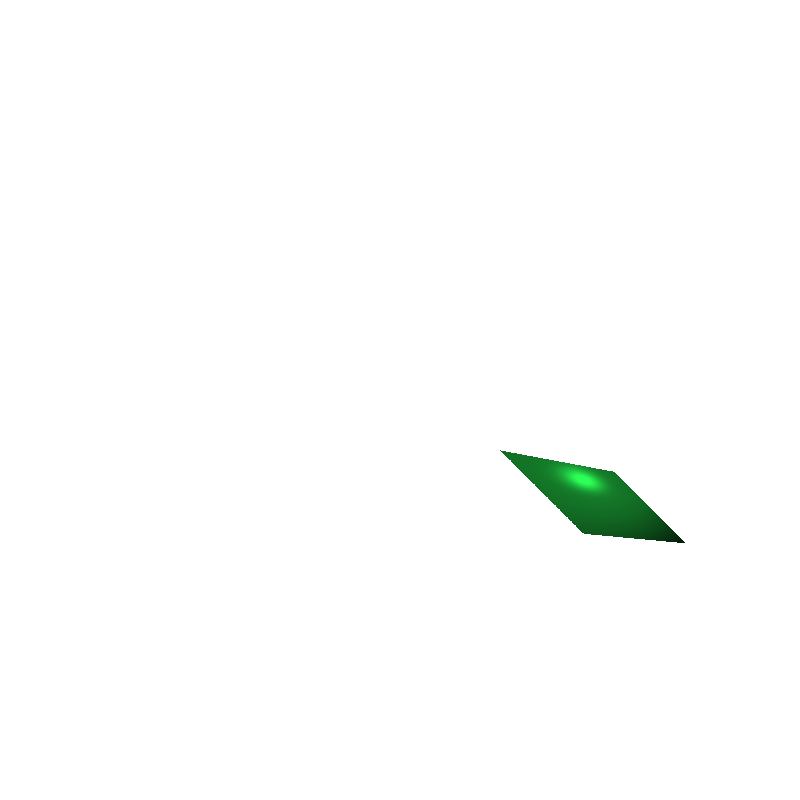

OS: macOS Big Sur 11.2.1 Compiler: Apple clang version 12.0.5 (clang-1205.0.22.9)
The code compiles and runs successfully on my MacBook Pro (M1).

---
# Ex.1: Basic Ray Tracing
## Ray Tracing a Parallelogram
The way I implementated here is using Ray-Triangle intersection showed in class. I devide the parallelogram into two triangles. The result is shown as 

## Ray Tracing with Perspective Projection
Change the ray_origin to a point outside of the camera. Used the same strategy as before. The result is shown as 
Parallelogram - 
Sphere - 

# Ex.2: Shading
## Shading a sphere with parallel projection
The result is shown as 
## Shading a parallelogram with perspective projection
The result is shown as 
