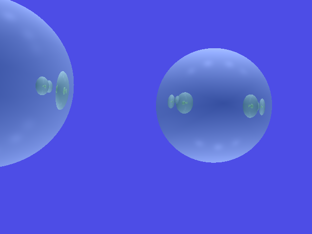
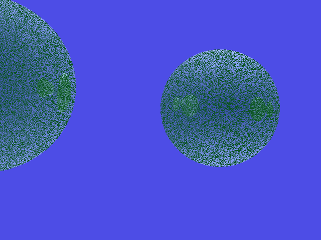
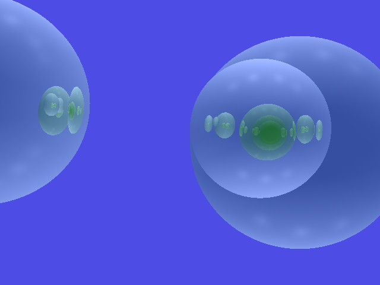
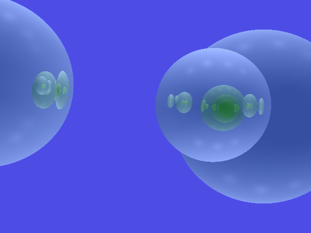
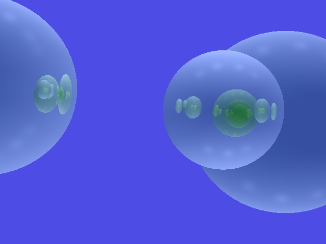
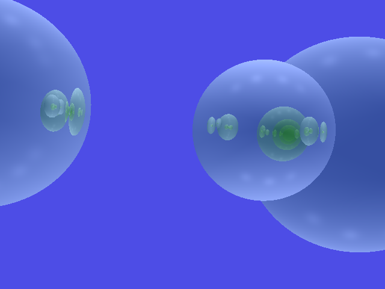
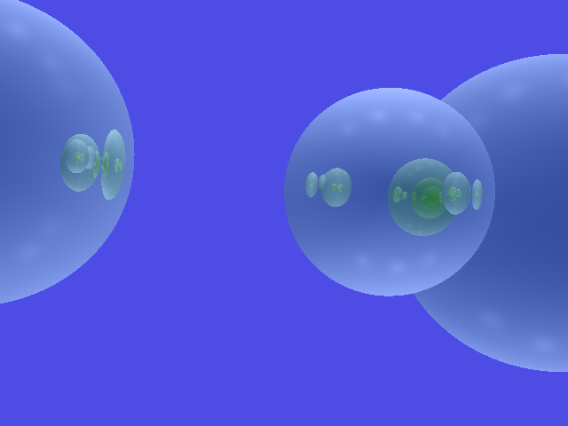
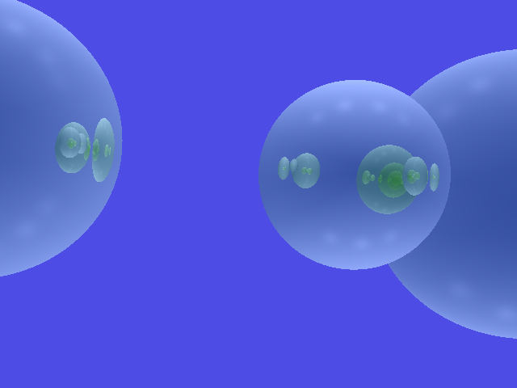
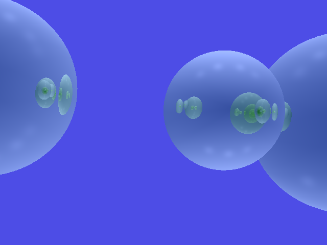

OS: macOS Big Sur 11.2.1 Compiler: Apple clang version 12.0.5 (clang-1205.0.22.9)
The code compiles and runs successfully on my MacBook Pro (M1).

---
Ex.1: Field of View and Perspective Camera
------------------------------------------
Used trigonometry to calculate `scale_y` in the code.

Ex.2: Shadow Rays
-----------------
Show what happens when the shadow ray is not offset by a small epsilon value.

With a small epsilon value:

Without a small epsilon value:

Ex.3: Reflection & Refraction
-----------------------------
Filled the starter code to implement reflected and refracted rays. 

Ex.4: Depth of Field
--------------------
1. Filled the starter code to implement depth of field.
2. Modify the input scene to move the rightmost sphere more into focus. Experiment with different settings of this effect. 

Sampling with 10 rays:

Sampling with 100 rays:

Ex.5: Animation
--------------------

Generate an animation by moving or changing size/properties of the object in the scene and exporting a series of images. 

I modified the position of first object from 1.0 to 2.0 and got the following series of images:

