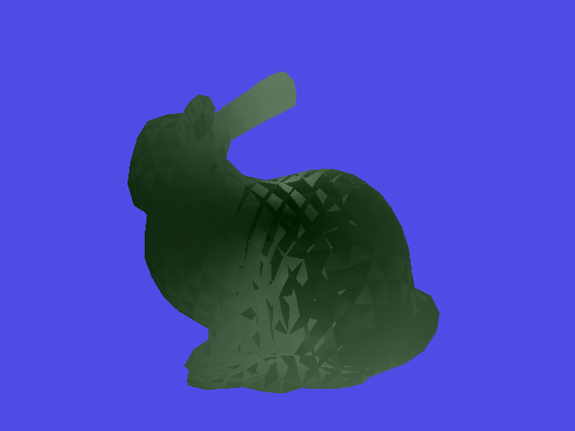
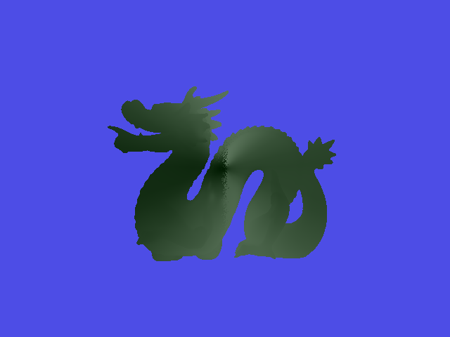

OS: macOS Big Sur 11.2.1 Compiler: Apple clang version 12.0.5 (clang-1205.0.22.9)
The code compiles and runs successfully on my MacBook Pro (M1).

---
Ex.1: Triangle Mesh Ray Tracing
------------------------------------------
The way I implementated here is using Ray-Triangle intersection showed in class, which is the same as what I did in assignment 2.

Ex.2: AABB Trees
-----------------
I used Top-Down Construction. The input triangles are split into groups of roughly equal size starting from the top node. 

The results generated are: 
 
. 
